# Awesome HTML Resume Templates — 20 Free, Open-Source Templates

[](LICENSE)
[](https://github.com/awesome-resume-templates/awesome-html-resume-templates)
[](#contributing)
[](#how-to-use)

**Awesome HTML Resume Templates** is a free, open-source collection of 20
hand-coded HTML and CSS resume templates you can download, customize, and use
for job hunting — no sign-up, no build tools, and no design software
required. Every template is plain HTML5 and CSS3: open a file, edit the text,
and you have a personalized resume. Whether you're after a minimalist
one-page resume template, an **ATS-friendly resume template html** recruiting
software can parse cleanly, a **dark mode resume template** for a modern
on-screen look, or a **printable resume template** tuned for a perfect PDF
export, there's a free HTML resume template here built for it. Each one is
self-contained, themeable with a few CSS variables, works fully offline once
downloaded, and is released under the MIT license — free for personal and
commercial use. No React, no Tailwind build step, no `npm install`: just
HTML and CSS you can actually read and edit yourself.

## Templates

| Preview | Template | Tags | Links |
| --- | --- | --- | --- |
| 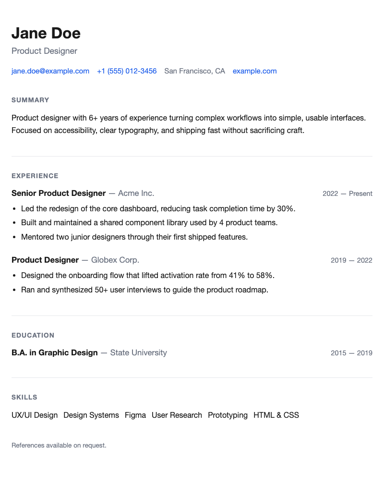 | **[Minimalist](templates/01-minimalist)** | Minimalist · Clean · One Page | [Live demo](https://htmlpreview.github.io/?https://github.com/awesome-resume-templates/awesome-html-resume-templates/blob/main/templates/01-minimalist/index.html) · [Get it](templates/01-minimalist) |
| 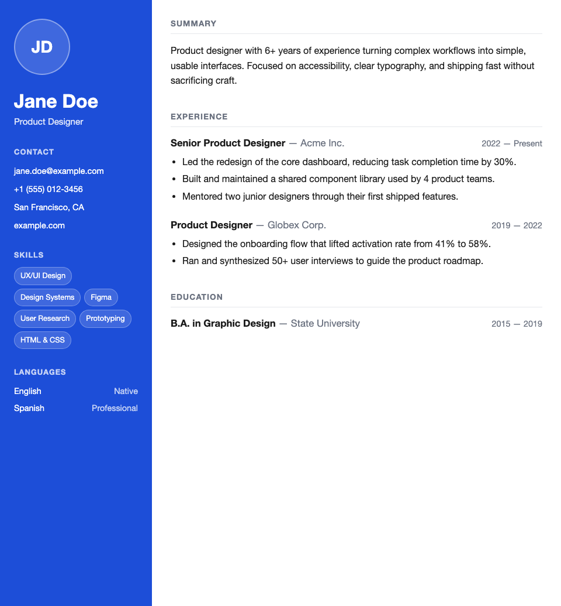 | **[Modern Sidebar](templates/02-modern-sidebar)** | Modern · Photo · Two-Column | [Live demo](https://htmlpreview.github.io/?https://github.com/awesome-resume-templates/awesome-html-resume-templates/blob/main/templates/02-modern-sidebar/index.html) · [Get it](templates/02-modern-sidebar) |
| 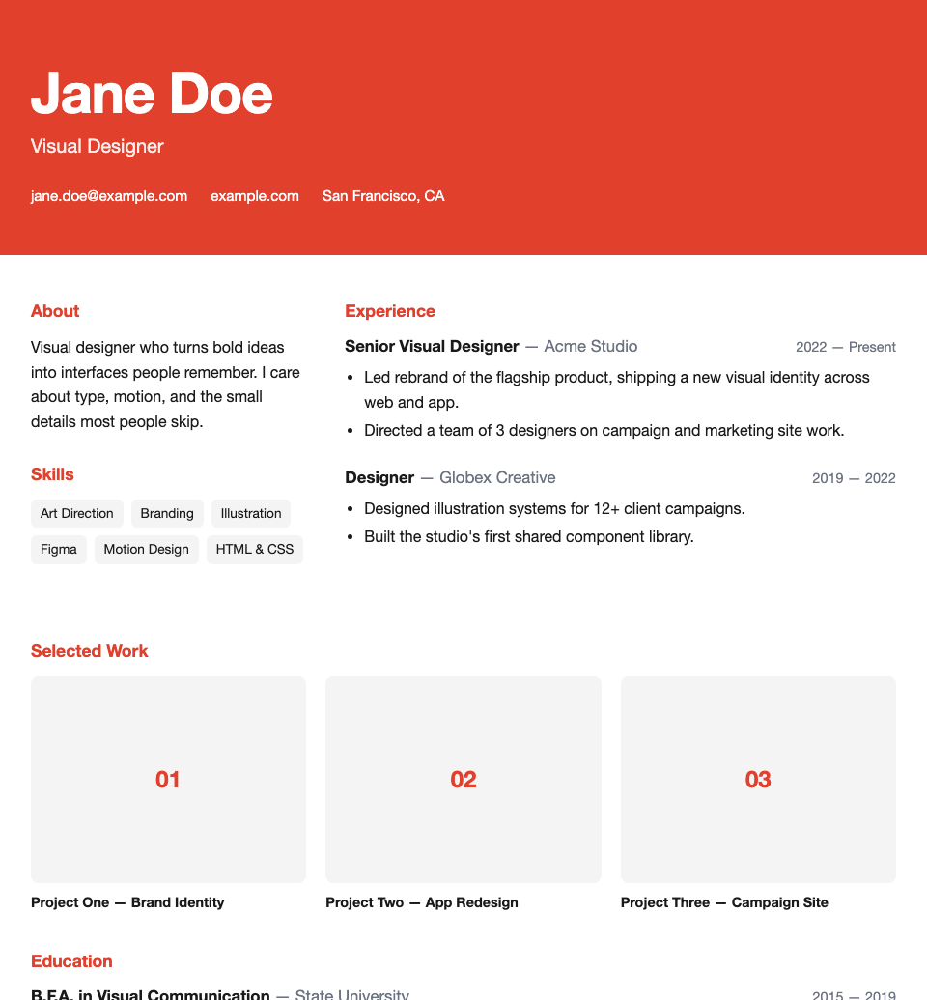 | **[Creative Portfolio](templates/03-creative-portfolio)** | Creative · Designer · Portfolio | [Live demo](https://htmlpreview.github.io/?https://github.com/awesome-resume-templates/awesome-html-resume-templates/blob/main/templates/03-creative-portfolio/index.html) · [Get it](templates/03-creative-portfolio) |
| 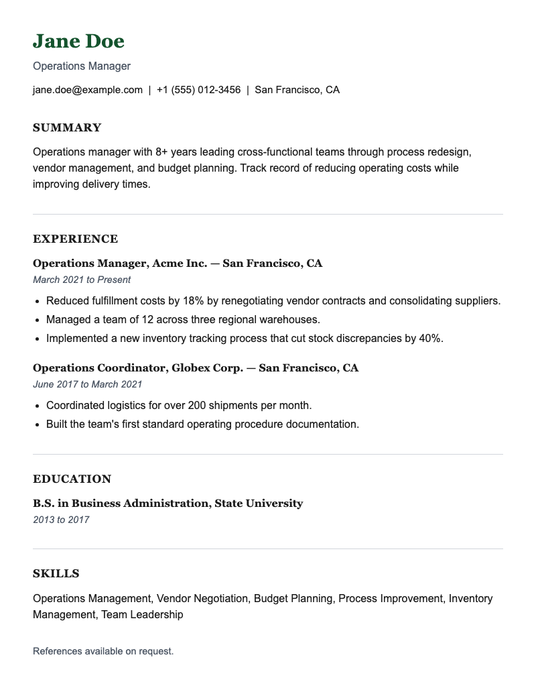 | **[ATS-Friendly](templates/04-ats-friendly)** | ATS-Friendly · Simple · Recruiter-Safe | [Live demo](https://htmlpreview.github.io/?https://github.com/awesome-resume-templates/awesome-html-resume-templates/blob/main/templates/04-ats-friendly/index.html) · [Get it](templates/04-ats-friendly) |
| 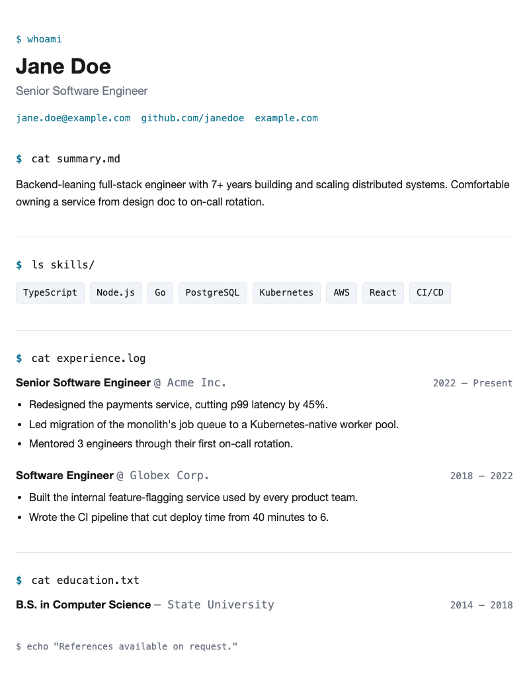 | **[Developer / Tech](templates/05-developer-tech)** | Developer · Tech · Monospace | [Live demo](https://htmlpreview.github.io/?https://github.com/awesome-resume-templates/awesome-html-resume-templates/blob/main/templates/05-developer-tech/index.html) · [Get it](templates/05-developer-tech) |
| 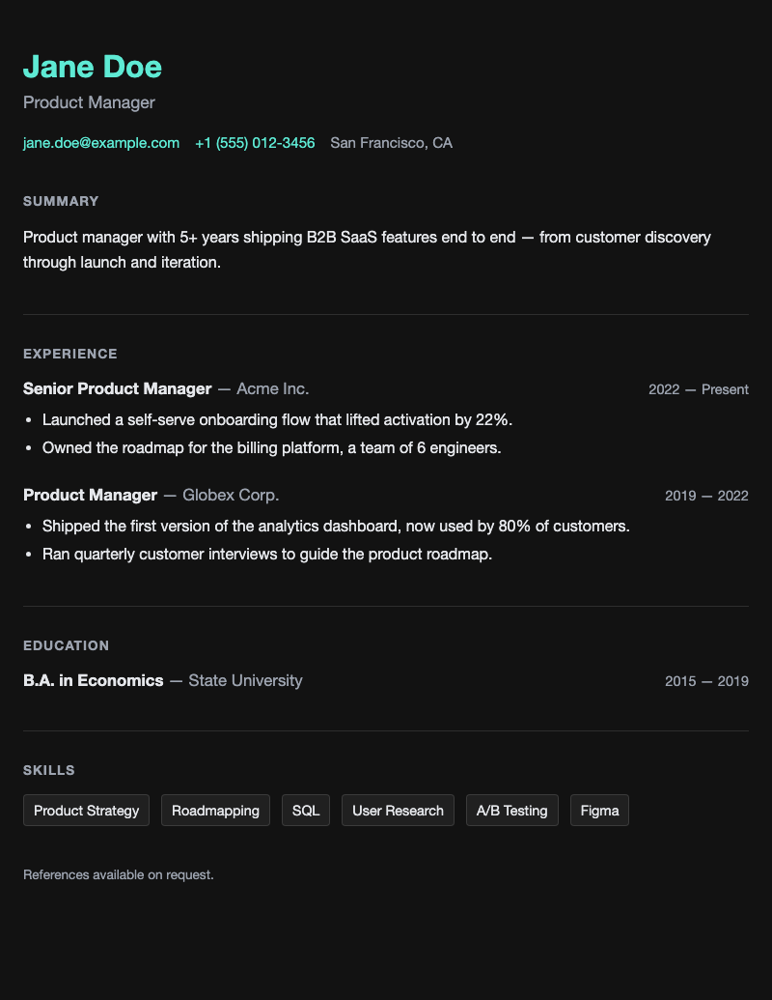 | **[Dark Mode](templates/06-dark-mode)** | Dark Mode · Modern | [Live demo](https://htmlpreview.github.io/?https://github.com/awesome-resume-templates/awesome-html-resume-templates/blob/main/templates/06-dark-mode/index.html) · [Get it](templates/06-dark-mode) |
| 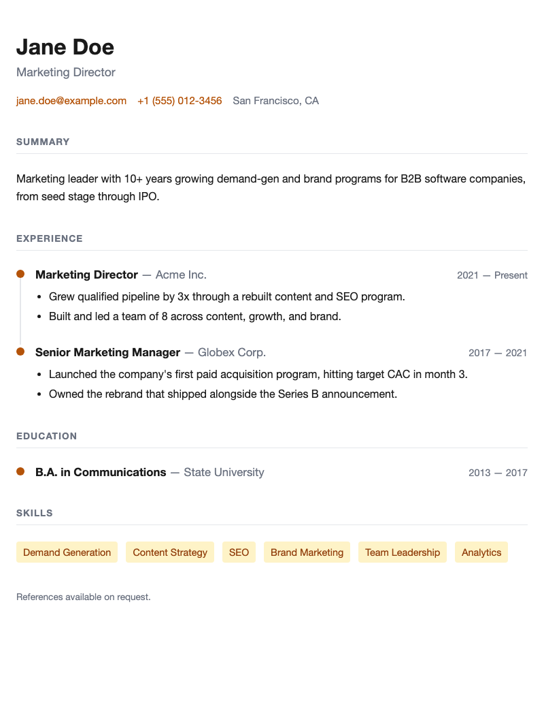 | **[Timeline](templates/07-timeline)** | Timeline · Visual | [Live demo](https://htmlpreview.github.io/?https://github.com/awesome-resume-templates/awesome-html-resume-templates/blob/main/templates/07-timeline/index.html) · [Get it](templates/07-timeline) |
| 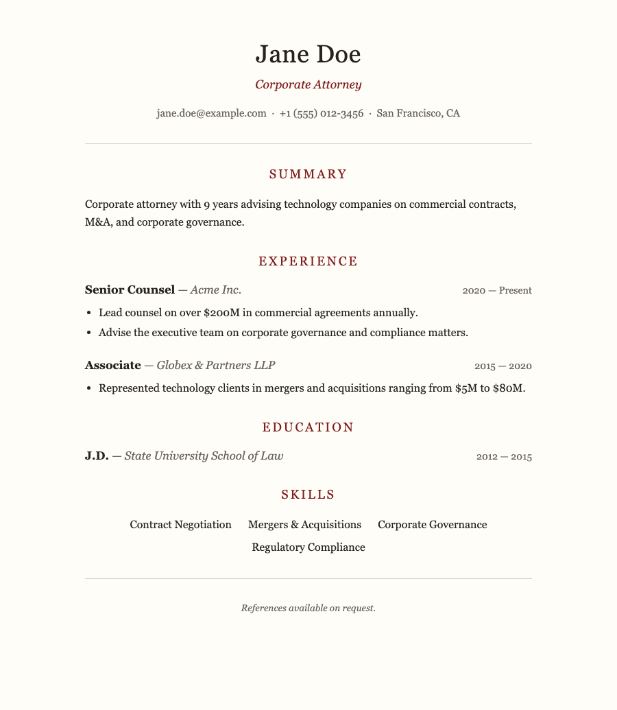 | **[Elegant Serif](templates/08-elegant-serif)** | Elegant · Classic · Serif | [Live demo](https://htmlpreview.github.io/?https://github.com/awesome-resume-templates/awesome-html-resume-templates/blob/main/templates/08-elegant-serif/index.html) · [Get it](templates/08-elegant-serif) |
| 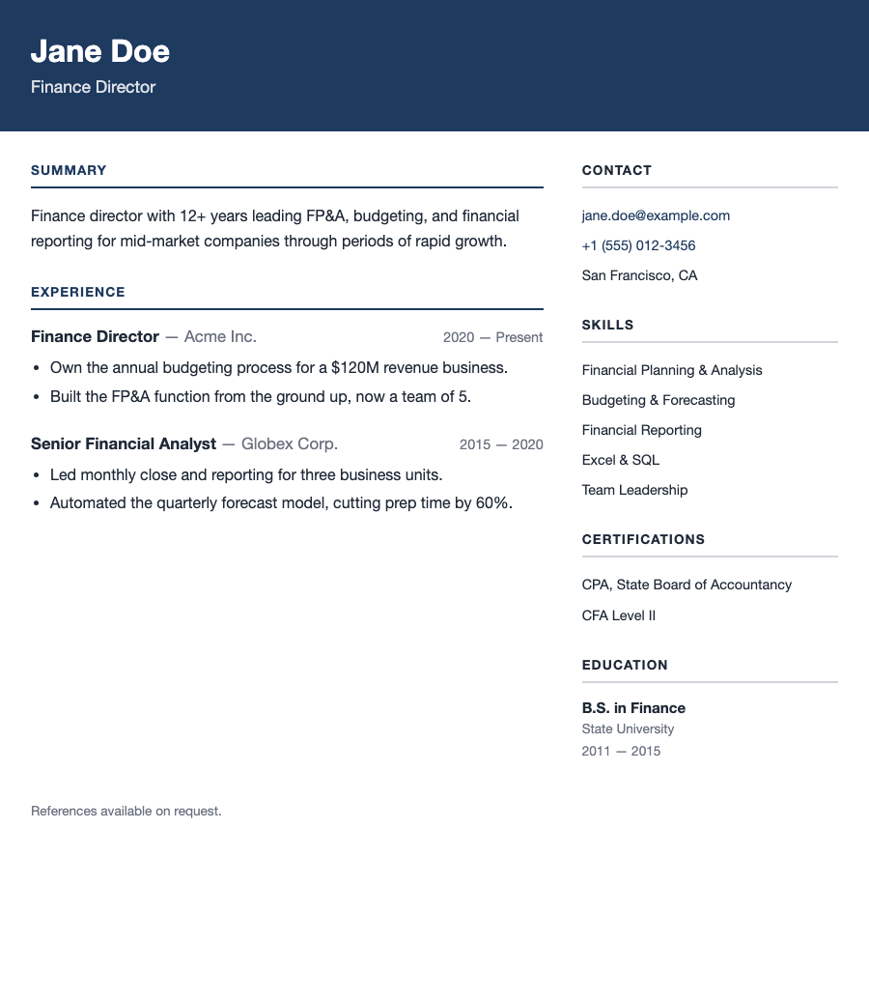 | **[Corporate Professional](templates/09-corporate-professional)** | Professional · Corporate · Two-Column | [Live demo](https://htmlpreview.github.io/?https://github.com/awesome-resume-templates/awesome-html-resume-templates/blob/main/templates/09-corporate-professional/index.html) · [Get it](templates/09-corporate-professional) |
| 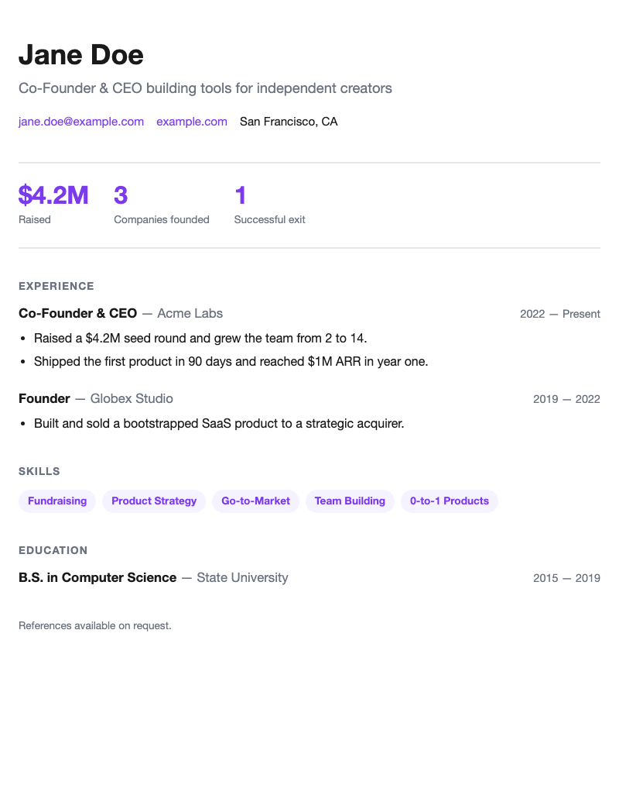 | **[Startup / Founder](templates/10-startup-founder)** | Startup · Founder · Bold | [Live demo](https://htmlpreview.github.io/?https://github.com/awesome-resume-templates/awesome-html-resume-templates/blob/main/templates/10-startup-founder/index.html) · [Get it](templates/10-startup-founder) |
| 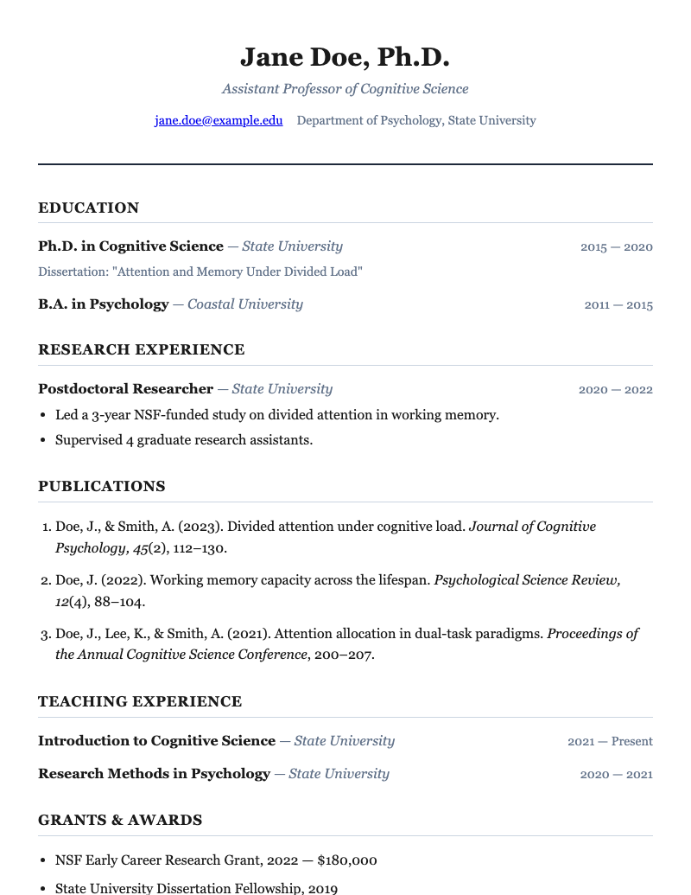 | **[Academic CV](templates/11-academic-cv)** | Academic · CV · Multi-Page | [Live demo](https://htmlpreview.github.io/?https://github.com/awesome-resume-templates/awesome-html-resume-templates/blob/main/templates/11-academic-cv/index.html) · [Get it](templates/11-academic-cv) |
| 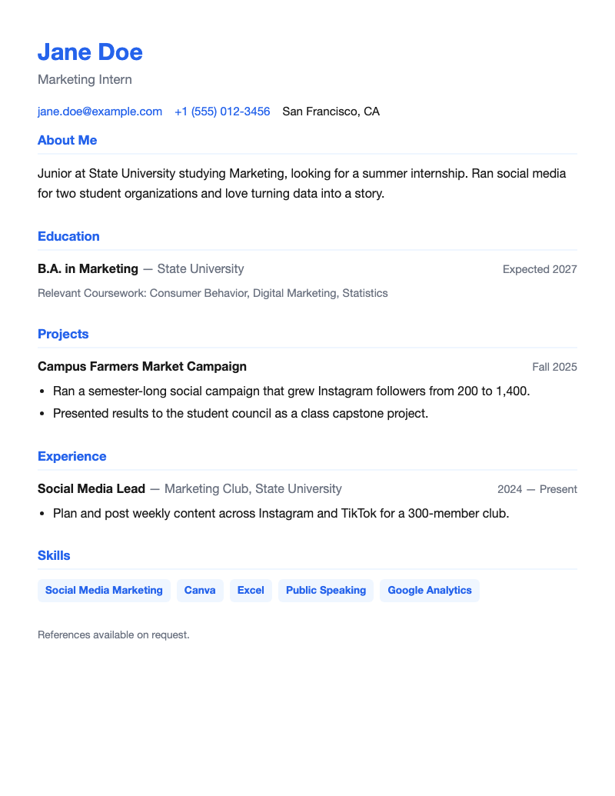 | **[Student / Entry-Level](templates/12-student-entry-level)** | Student · Entry-Level · No Experience | [Live demo](https://htmlpreview.github.io/?https://github.com/awesome-resume-templates/awesome-html-resume-templates/blob/main/templates/12-student-entry-level/index.html) · [Get it](templates/12-student-entry-level) |
| 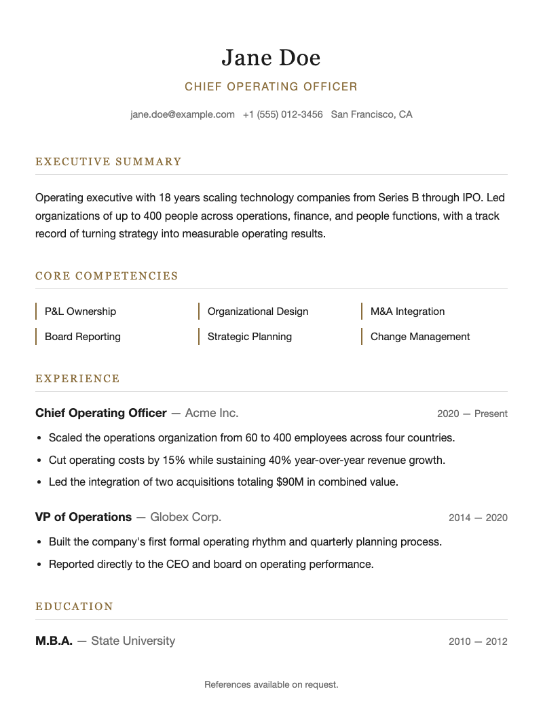 | **[Executive](templates/13-executive)** | Executive · Senior · Minimal | [Live demo](https://htmlpreview.github.io/?https://github.com/awesome-resume-templates/awesome-html-resume-templates/blob/main/templates/13-executive/index.html) · [Get it](templates/13-executive) |
| 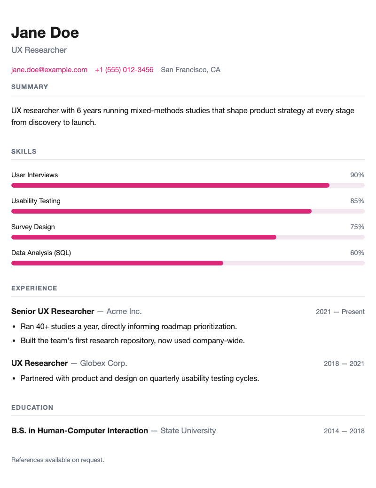 | **[Infographic](templates/14-infographic)** | Infographic · Skill Bars · Visual | [Live demo](https://htmlpreview.github.io/?https://github.com/awesome-resume-templates/awesome-html-resume-templates/blob/main/templates/14-infographic/index.html) · [Get it](templates/14-infographic) |
| 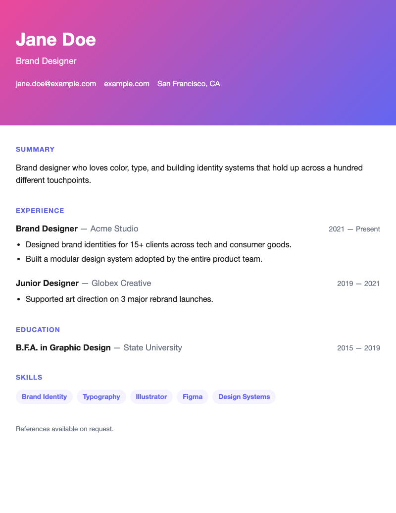 | **[Gradient / Colorful](templates/15-gradient-colorful)** | Colorful · Gradient · Modern | [Live demo](https://htmlpreview.github.io/?https://github.com/awesome-resume-templates/awesome-html-resume-templates/blob/main/templates/15-gradient-colorful/index.html) · [Get it](templates/15-gradient-colorful) |
| 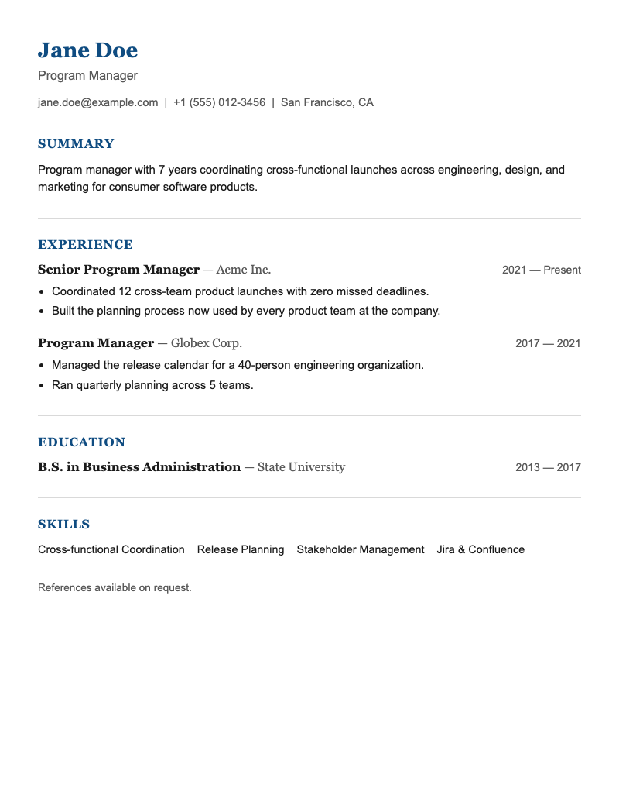 | **[Print-Optimized](templates/16-print-optimized)** | Print-Ready · PDF · A4 / Letter | [Live demo](https://htmlpreview.github.io/?https://github.com/awesome-resume-templates/awesome-html-resume-templates/blob/main/templates/16-print-optimized/index.html) · [Get it](templates/16-print-optimized) |
| 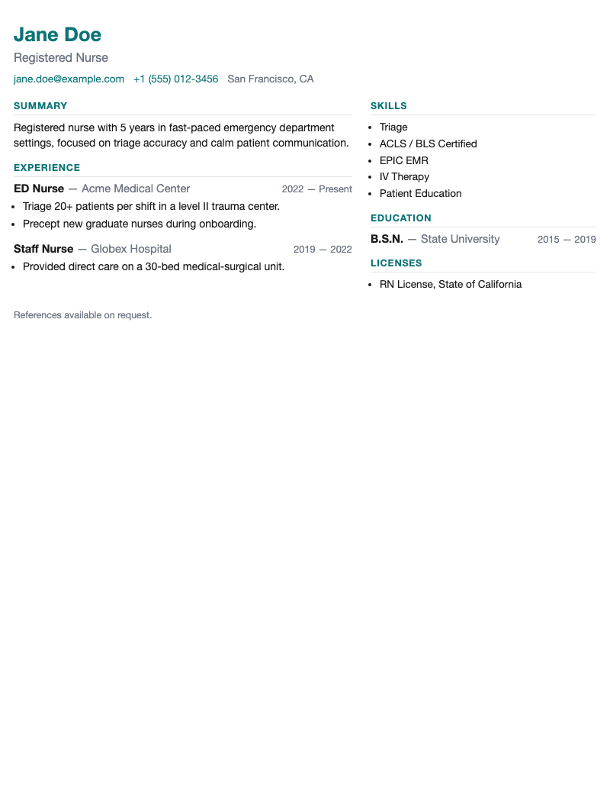 | **[Two-Column Compact](templates/17-two-column-compact)** | One-Page · Compact · Dense | [Live demo](https://htmlpreview.github.io/?https://github.com/awesome-resume-templates/awesome-html-resume-templates/blob/main/templates/17-two-column-compact/index.html) · [Get it](templates/17-two-column-compact) |
| 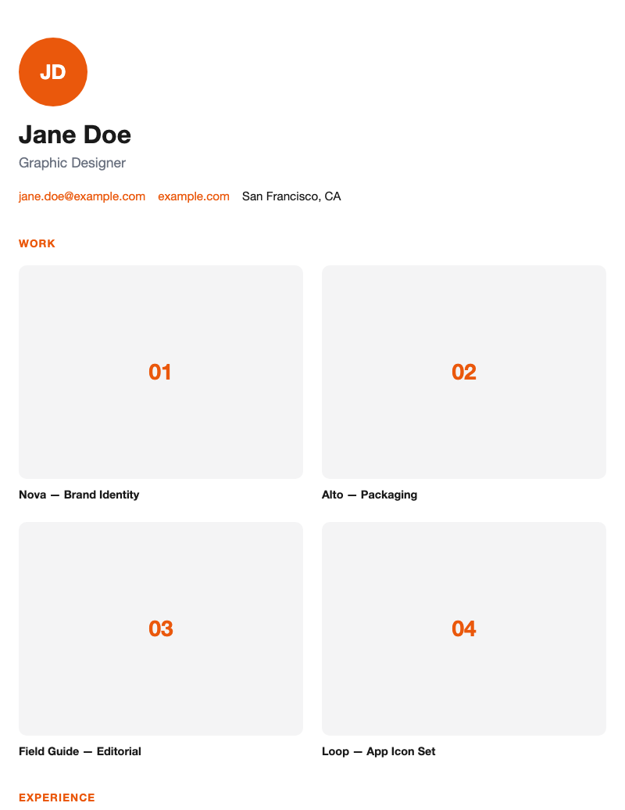 | **[Designer / Visual](templates/18-designer-visual)** | Designer · Portfolio · Visual | [Live demo](https://htmlpreview.github.io/?https://github.com/awesome-resume-templates/awesome-html-resume-templates/blob/main/templates/18-designer-visual/index.html) · [Get it](templates/18-designer-visual) |
| 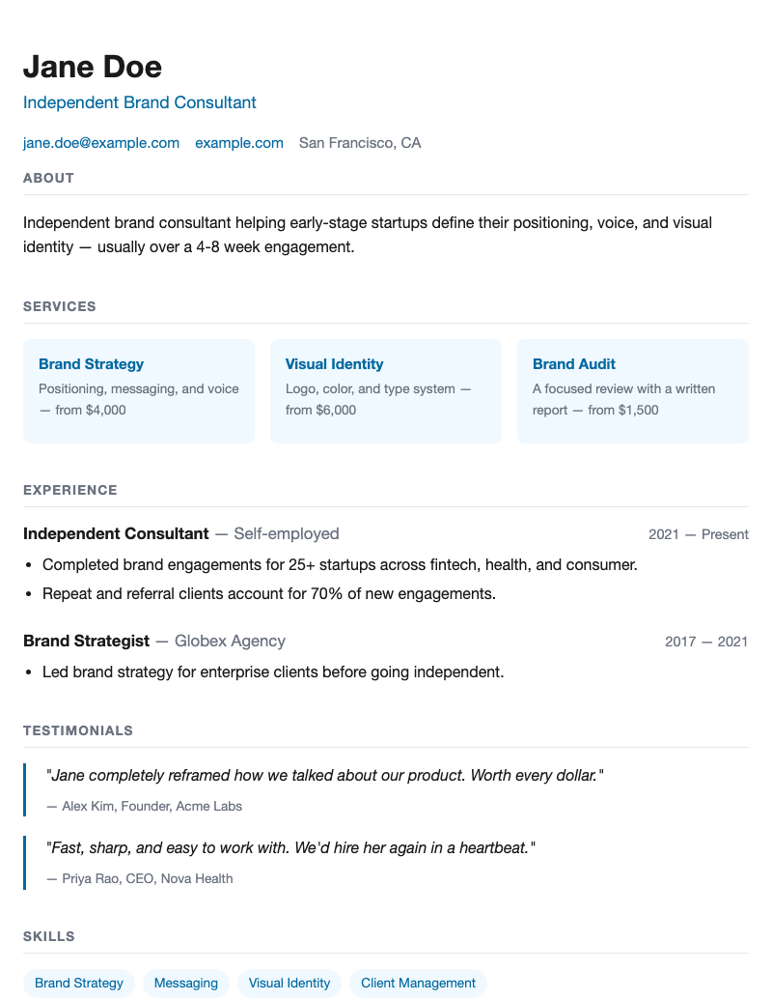 | **[Freelancer / Consultant](templates/19-freelancer-consultant)** | Freelancer · Consultant · Services | [Live demo](https://htmlpreview.github.io/?https://github.com/awesome-resume-templates/awesome-html-resume-templates/blob/main/templates/19-freelancer-consultant/index.html) · [Get it](templates/19-freelancer-consultant) |
| 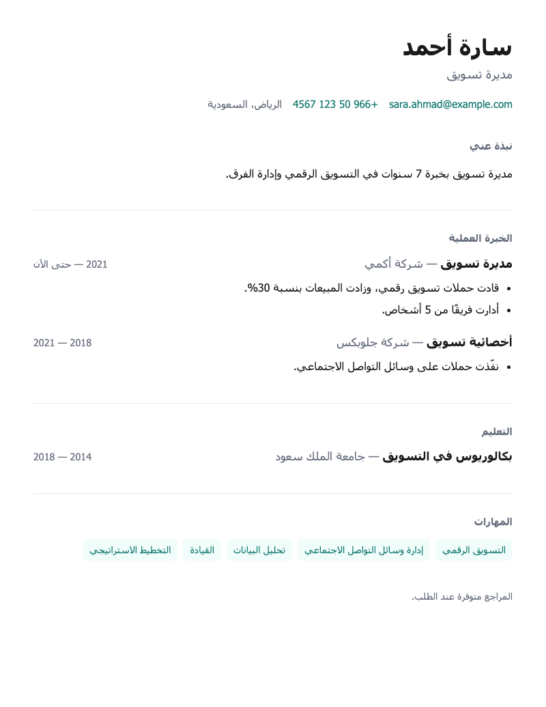 | **[RTL / Multilingual](templates/20-rtl-multilingual)** | RTL · Arabic · Multilingual | [Live demo](https://htmlpreview.github.io/?https://github.com/awesome-resume-templates/awesome-html-resume-templates/blob/main/templates/20-rtl-multilingual/index.html) · [Get it](templates/20-rtl-multilingual) |

## Why these templates

- **Free and open source** — MIT licensed, no attribution required, no paywalled "premium" versions.
- **No sign-up, no account, no tracking** — download and go.
- **No build tools** — no `npm install`, no bundler, no framework. Just HTML and CSS.
- **Easy to customize** — every template's colors and fonts live in a handful of CSS variables at the top of `style.css`.
- **Print-ready** — every template ships a print stylesheet, so your browser's "Save as PDF" produces a clean result.
- **Works offline** — no CDN dependencies; open the file and it just works, even with no internet connection.
- **ATS-friendly options included** — templates like [ATS-Friendly](templates/04-ats-friendly) are built specifically to parse cleanly in applicant tracking systems.

## How to use

1. **Browse** the gallery above and pick a template.
2. **Download** just that template's folder, or clone the whole repo:
   ```
   git clone https://github.com/awesome-resume-templates/awesome-html-resume-templates.git
   ```
3. **Customize**: open the template's `index.html` in any text editor, replace the placeholder text with your own (each template has inline comments marking what to edit), then open it in a browser to preview. When it looks right, use your browser's Print dialog (<kbd>Ctrl</kbd>/<kbd>Cmd</kbd> + <kbd>P</kbd>) and choose **Save as PDF**.

No coding experience needed — if you can edit a text file, you can customize any template in this collection.

## FAQ

**Are these resume templates free?**
Yes — completely free and open source under the MIT license. Download, customize, and use them for personal or commercial job applications with no attribution required.

**Are they ATS-friendly?**
Most of them, and one — [ATS-Friendly](templates/04-ats-friendly) — is built specifically for it: strict single column, no tables, no images, plain semantic HTML. In general, any template here using a single-column layout with real headings (rather than text baked into an image) will parse well in most applicant tracking systems.

**How do I convert an HTML resume to PDF?**
Open the template's `index.html` in your browser, fill in your information, then use your browser's Print dialog (<kbd>Ctrl</kbd>/<kbd>Cmd</kbd> + <kbd>P</kbd>) and choose **Save as PDF**. Every template ships with a print stylesheet tuned for a clean PDF export.

**Can I use these for commercial use / job hunting?**
Yes. They're MIT licensed, so you can use them for job hunting, freelance client work, or anything else, free of charge.

**How do I contribute a new template?**
Open an issue describing the style you'd like to add, then submit a PR following the conventions described below.

## Contributing

Contributions are welcome — new templates, bug fixes, and accessibility
improvements. Each template lives in its own `templates/NN-slug/` folder as a
self-contained `index.html` + `style.css` + `thumbnail.png`, with no shared
dependencies between templates. Open an issue to propose a new template
style, then submit a PR that adds a row to the gallery table above.

## License

Licensed under the [MIT License](LICENSE) — free to use, modify, and
distribute, including for commercial purposes.
